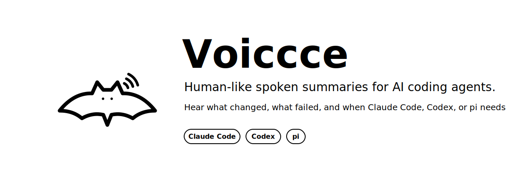
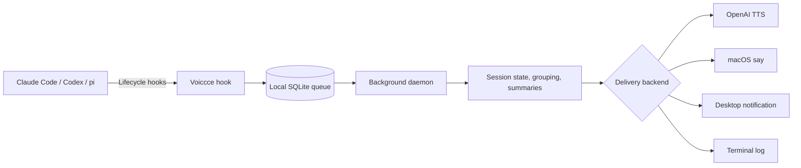

# Voiccce

<div align="center">



[](#requirements) [](https://www.python.org/)
[](#supported-agents) [](#supported-agents) [](#supported-agents)
[](#project-status) [](LICENSE)

[Install](#quick-start) | [Features](#features) | [Menu bar](#menu-bar) | [Supported agents](#supported-agents) | [How it works](#how-it-works) | [Configuration](#configuration)

</div>

---

Voiccce is the spoken status layer for parallel AI coding agents. It turns local agent lifecycle hooks into short, project-aware briefings that explain what happened, what passed or failed, and when the agent needs a decision: "Claude Code in frontend needs permission to install dependencies"; "Codex in api finished. All tests pass"; "Claude Code in payments failed while running the test suite."

Run several agents at once and let Voiccce tell you which project needs attention, finished cleanly, or failed.

## Quick start

The fastest path is the bootstrap installer. It checks for Python 3.12+ and pipx, installs whatever is missing (via Homebrew or a pip fallback), installs Voiccce, and prints the next step:

```bash
git clone https://github.com/blackbalancef/voiccce.git
cd voiccce
./install.sh
```

Or in one line, without cloning first:

```bash
curl -fsSL https://raw.githubusercontent.com/blackbalancef/voiccce/main/install.sh | bash
```

Then run the setup wizard:

```bash
voiccce setup
```

The wizard walks you through arrow-key menus:

1. **Agents** — a checkbox picker: `↑`/`↓` to move, `space` to toggle Claude Code, Codex, and/or `pi`, `a` for all, `enter` to confirm. Claude Code + Codex are pre-selected.
2. **Language** — type the language for spoken summaries, such as `English`, `Russian`, `Spanish`, or `Japanese`.
3. **Voice** — pick **OpenAI TTS** (natural cloud voice; prompts for your API key and stores it in the macOS Keychain) or the **macOS built-in voice** (offline, free, no key).
4. **Menu bar** — a yes/no prompt to install and start the optional macOS menu bar app.
5. **Stop-speaking hotkey** — when the menu bar app is enabled, pick the global shortcut (default `⌥⌘S`) that silences playback from any app, or choose Off.

<details>
<summary>Prefer manual steps? (you already have pipx)</summary>

```bash
git clone https://github.com/blackbalancef/voiccce.git
cd voiccce
pipx install --force .
voiccce setup
```

</details>

No OpenAI API key? Pick the macOS voice in the wizard, or skip the picker with:

```bash
voiccce setup --local
```

Flags skip the matching menu when you already know what you want:

- Agents: pass a target — `voiccce setup claude-code`, `codex`, `pi`, or `both` (claude-code + codex).
- Language: `--language Spanish` (or any language name you want the AI summaries translated into).
- Voice: `--openai` (cloud) or `--local` (macOS).
- Menu bar: `--menubar` or `--no-menubar`.

<details>
<summary>What does setup configure?</summary>

`voiccce setup` first asks which agents to wire, which language to speak, which voice to use (and, for OpenAI TTS, your API key), and whether to install the menu bar app — all up front. Then it: configures the voice (OpenAI TTS with voice `marin`, or macOS `say` with voice `Alex`), stores your OpenAI key in the macOS Keychain when needed, installs hooks/extensions, starts the daemon, installs and starts the optional menu bar app if you chose to, and finally sends a test notification you should hear.

If Codex was already running, restart the Codex app or `codex app-server`, then open `/hooks` in Codex and trust the Voiccce hooks.

</details>

## Requirements

- macOS, for voice playback and desktop notifications.
- Python 3.12+.
- `pipx` (`brew install pipx && pipx ensurepath`).
- Claude Code, Codex CLI, or pi.
- Optional: an OpenAI API key for the recommended voice and AI summaries. `--local` works offline with macOS `say`.

## Project status

Voiccce is currently alpha. The core workflow is usable, but CLI and configuration formats may change before v1.0.

## Features

- Parallel-session aware: notifications include the agent and project name.
- Local-first queue: hooks write sanitized events to SQLite under `~/.voiccce`.
- Grouping and deduplication: repeated lifecycle events are batched and cooled down.
- Spoken summary delivery: OpenAI TTS, macOS `say`, desktop notifications, and terminal logs.
- Runtime controls: stop speech, mute temporarily, or manage the daemon from the CLI.
- Global stop-speaking hotkey (menu bar app only): while the menu bar app runs, a system-wide shortcut (default `⌥⌘S`) silences the current announcement from any app — no Accessibility permission required.
- Optional menu bar app: quick mute, stop-speaking, language entry, the stop-hotkey picker, daemon, config, log, and spend controls.
- AI summaries: completed-session updates can be rewritten into concise spoken reports.
- AI summary translation: choose any target language name for rewritten spoken summaries.
- English and Russian template-only message text.

## Menu bar

The optional macOS menu bar companion gives quick controls without opening a terminal. `voiccce setup` offers to install and start it for you — or do it manually:

```bash
pipx inject voiccce pyobjc-framework-Cocoa
voiccce menubar-start
```

It shows estimated spend and audio stats, and offers Stop Speaking, Notification language, a Stop hotkey picker, Mute 10 min / 1 hour, Unmute, Start/Stop Daemon, Open Config, and Open Daemon Log.

### Stop-speaking hotkey

While the menu bar app is running, a global keyboard shortcut instantly stops the current voice playback — even when another app is focused, so you can silence Voiccce mid-meeting without switching windows. The default is `⌥⌘S` (Option-Command-S). It registers through Carbon, so it needs **no Accessibility or Input-Monitoring permission**, and only the chosen combination is ever captured.

Change it from the menu bar (`Stop hotkey ▸`), during `voiccce setup`, or from the CLI:

```bash
voiccce config --hotkey "ctrl+alt+cmd+."   # set a new combo (cmd, ctrl, alt, shift + a key)
voiccce config --hotkey off                 # disable it
```

```bash
voiccce stop-speaking
voiccce mute --for 10m
voiccce unmute
voiccce menubar-stop
```

## Supported agents

| Capability | Claude Code | Codex | pi |
| --- | :---: | :---: | :---: |
| Installed by `voiccce setup` (default) | Yes | Yes | - |
| Installed by explicit target | Yes | Yes | Yes |
| Task completed | Yes | Yes | Yes |
| Permission request | Yes | Yes | - |
| General attention notification | Yes | - | - |
| Task failed | Yes | - | - |
| Subagent completed | Yes | Yes | - |
| User reply interrupts current speech | Yes | - | Yes |
| Custom config/home directory | Yes | Yes | Yes |

## How it works



Hooks enqueue sanitized events locally. The daemon reads pending events, suppresses duplicates, groups related sessions, optionally generates a short summary, and sends the final notification through the configured delivery backend.

Everything Voiccce stores lives under `~/.voiccce/`, including `config.toml`, `events.sqlite3`, daemon logs, and menu bar logs.

## Configuration

The main config file is `~/.voiccce/config.toml`. `voiccce config` writes it
atomically (and migrates older files in place), so prefer the CLI over hand
edits. After manual edits, restart the daemon with `voiccce stop && voiccce start`.

```bash
voiccce config --language Spanish
voiccce config --voice cedar
voiccce config --voice-backend macos_say
voiccce config --voice-backend openai_tts --voice marin
voiccce stop && voiccce start
```

Run `voiccce config` with no flags to print the current configuration.

### `voiccce config` flags

| Flag | What it does | Default |
| --- | --- | --- |
| `--language NAME` | Spoken-summary language (`English`, `Russian`, `Spanish`, …) | `English` |
| `--voice-backend {macos_say,openai_tts}` | Voice delivery backend | depends on setup |
| `--voice NAME` | Voice name (`Alex`, `marin`, `cedar`, …) | backend-specific |
| `--voice-speed`, `--voice-rate`, `--voice-model`, `--voice-format`, `--voice-instructions` | Fine-tune TTS output | — |
| `--hotkey COMBO` / `--hotkey off` | Global stop-speaking hotkey (menu bar app) | `⌥⌘S` |
| `--summary {on,off}` | Enable/disable AI summaries | `on` |
| `--summary-privacy {metadata_only,full_last_message}` | How much of the assistant's last message summaries may send to OpenAI | `full_last_message` |
| `--summary-model NAME` | Summary model | `gpt-5.4-nano` |
| `--summary-provider NAME` | Summary provider (`openai`, `fallback`) | `openai` |
| `--summary-pipeline-log {on,off}` | Write the plaintext summary pipeline log (`summary.log`) — see [Privacy](#privacy) | `on` |
| `--event NAME=on\|off` | Toggle one event type; repeatable. Names: `task_finished`, `permission_needed`, `input_needed`, `task_failed`, `subagent_finished` | finished/permission/input/failed on, subagent off |
| `--max-events-per-minute N` | Rate-limit notifications per minute (now enforced) | `6` |
| `--daily-spend-cap USD` | Daily OpenAI spend cap; `0` = no cap. Over the cap, Voiccce falls back to the free macOS voice | `0` |
| `--monthly-spend-cap USD` | Monthly OpenAI spend cap; `0` = no cap | `0` |
| `--event-retention-days N` | Days to keep processed events before auto-prune + vacuum; `0` = keep forever | `30` |
| `--interrupt-on-reply {on,off}` | Stop the current announcement when you reply into that session | `on` |
| `--quiet-hours {on,off}` | Enable/disable the nightly quiet-hours window | `on` |
| `--quiet-hours-from HH:MM` / `--quiet-hours-to HH:MM` | Quiet-hours window | `23:00` / `09:00` |
| `--quiet-hours-voice {on,off}` / `--quiet-hours-desktop {on,off}` | Allow voice / desktop during quiet hours | voice off, desktop on |
| `--idle-reminders {on,off}` | Speak a short "still waiting" nudge before the agent's prompt cache expires | `on` |
| `--idle-reminder-margin MIN` | Minutes before cache expiry to nudge (Claude ~5 min window → fires at ~4) | `1` |
| `--reset` / `--reset [--reset-section NAME]` | Reset the whole config (or one `[section]`) to defaults; a backup is written first | — |
| `--list-backups` | List `config.toml.bak-*` backups, newest first | — |
| `--restore [BACKUP]` | Restore from a backup (newest if omitted); the current file is backed up first | — |

Quiet hours are **enabled by default from 23:00 to 09:00** (now actually
enforced): voice playback is suppressed while desktop notifications still
appear. Change it from the CLI — e.g. `voiccce config --quiet-hours off` to
disable, or `voiccce config --quiet-hours-from 22:30 --quiet-hours-to 08:00`
to move the window (or `--quiet-hours-voice on` to keep speaking at night).

Every config change writes a timestamped `config.toml.bak-*` backup; use
`voiccce config --list-backups` and `voiccce config --restore` to roll back.

**Idle reminders.** When a session finishes and you don't reply, Voiccce speaks
one short nudge — *"<project> ждёт твоего ответа." / "<project> is waiting for
your reply."* — timed to land just before the agent's prompt cache expires
(Claude's ~5-minute window → fires at ~4 minutes, so a reply still hits a warm
cache). It's one-shot per idle period and is cancelled the moment you reply.
Turn it off with `voiccce config --idle-reminders off`, or change the lead time
with `--idle-reminder-margin`.

<details>
<summary>OpenAI key and voice backend</summary>

`voiccce setup` stores the OpenAI key in the macOS Keychain. Voiccce resolves the key from `OPENAI_API_KEY`, then `~/.voiccce/.env`, then Keychain.

```bash
voiccce secret status openai
voiccce secret set openai
voiccce secret delete openai
voiccce setup --reset-key
```

Use `voiccce setup --local` or `voiccce config --voice-backend macos_say` to run without a key.

</details>

Completed-session events can be rewritten into concise spoken explanations. The default config uses `provider = "openai"` and `model = "gpt-5.4-nano"` when credentials are available. Set `[summary].enabled = false` (or `voiccce config --summary off`) for template-only messages, or use `--summary-privacy metadata_only` to summarize only the already-short notification text instead of the assistant's last message.

## Useful commands

```bash
voiccce status
voiccce events --limit 20
voiccce test
voiccce doctor              # health checks for config, hooks, key, daemon, audio
voiccce logs --daemon -f    # tail a log (--daemon|--menubar|--hook|--summary)
voiccce --version           # or -V
voiccce --help
```

The legacy `agent-chime` and `agent-voice` commands are compatibility aliases for `voiccce`.

## Maintenance

Voiccce keeps everything under `~/.voiccce/`. A few commands help keep it tidy:

```bash
voiccce prune --older-than 30d   # delete old processed events and VACUUM the db
voiccce clear --events           # clear queued/processed events
voiccce clear --history          # clear notification/session history + summary.log
voiccce clear --all --yes        # clear both, no prompt
```

Processed events are also auto-pruned (and the database vacuumed) once they pass
the configured `--event-retention-days` (default 30; `0` keeps them forever).

## Autostart

Autostart is **opt-in and off by default**. When enabled, Voiccce installs macOS
`launchd` agents so the daemon (and menu bar app, if installed) come back after a
reboot or login:

```bash
voiccce autostart enable
voiccce autostart status
voiccce autostart disable
```

## Update

`voiccce update` updates the installation and re-applies hooks for every wired
agent. From a local checkout it reinstalls from that source; with no checkout
(for example a non-editable pipx install) it self-fetches from
`git+https://github.com/blackbalancef/voiccce@main`. It prints the version before
and after, then runs a quick post-update health probe.

```bash
voiccce update                       # update + re-apply hooks (restarts daemon/menu bar)
voiccce update --ref v0.2.0          # pin a specific git ref when fetching from GitHub
voiccce update --source /path/to/checkout   # update from a specific local checkout
voiccce update --dev                 # editable (-e) install from a checkout, for development
voiccce update --no-hooks            # skip re-applying hooks
voiccce update --no-probe            # skip the post-update health probe
voiccce update --no-restart          # do not restart daemon/menu bar afterward
```

## Uninstall

`voiccce uninstall` with no target tears down everything: it stops the daemon and
menu bar app, strips the `VOICCCE=1` hook blocks from every wired agent, deletes
the OpenAI key from the Keychain, disables autostart, and prints the
package-removal follow-up (`pipx`/`pip`). It keeps `~/.voiccce` unless you pass
`--purge`. Pass a target to unwire just one integration.

```bash
voiccce uninstall                 # tear down everything (keeps ~/.voiccce)
voiccce uninstall --purge --yes   # also delete ~/.voiccce, no prompt
voiccce uninstall claude-code     # remove only the Claude Code hooks
voiccce uninstall --restore-backups   # restore each integration's pre-install backup
```

Then remove the package as printed (for a pipx install, `pipx uninstall voiccce`).

<details>
<summary>Manual uninstall fallback</summary>

If `voiccce uninstall` is unavailable, do it by hand:

1. Stop the services: `voiccce stop` and `voiccce menubar-stop`.
2. Delete the key: `voiccce secret delete openai`.
3. Remove the hook blocks marked `VOICCCE=1` from `~/.claude/settings.json` and `~/.codex/hooks.json`.
4. Delete the pi extension: `rm -f ~/.pi/agent/extensions/voiccce.ts` (or the matching `PI_CODING_AGENT_DIR`).
5. Disable autostart: `voiccce autostart disable`.
6. Remove the data directory: `rm -rf ~/.voiccce`.
7. Uninstall the package: `pipx uninstall voiccce`.

</details>

## Troubleshooting

- **I hear nothing.** Run `voiccce doctor` for a full health check, then `voiccce test` to send a sample notification. Check that you are not muted (`voiccce unmute`), that you are outside quiet hours (default 23:00–09:00, where voice is suppressed), and that your OpenAI key is valid (`voiccce secret status openai`) — over a spend cap, Voiccce falls back to the free macOS voice.
- **Daemon not running.** Start it with `voiccce start`, and inspect `voiccce logs --daemon` for errors.
- **Doesn't start after a reboot.** Autostart is off by default; enable it with `voiccce autostart enable`.
- **You run Claude Code from a custom config dir / profile (`CLAUDE_CONFIG_DIR`, e.g. `~/.claude-personal`).** `voiccce setup` wires the default `~/.claude/settings.json`. If your sessions use another dir, wire it explicitly: `voiccce install claude-code --claude-config-dir ~/.claude-personal` (repeat per profile). Note: `voiccce doctor`/`status` inspect only the default `~/.claude`, so they may report "wired" for the default while your active profile is not — the reliable check is to finish a task and listen. Restart any open session after wiring so it reloads the hooks.

## Privacy

Voiccce runs locally. Claude Code, Codex, and pi hook payloads are normalized and sanitized before storage; the SQLite database keeps metadata and the short notification summary, not the complete hook payload.

**What leaves your machine.** When OpenAI TTS is enabled, the final notification sentence is sent to the speech endpoint. When AI summaries are enabled, the selected summary input is sent to the OpenAI Responses API before delivery. By default `summary_privacy_level = "full_last_message"`, which sends the assistant's full last message to OpenAI; set `voiccce config --summary-privacy metadata_only` to send only the already-short notification text instead. With the local macOS `say` backend and summaries disabled (`voiccce config --summary off`), voice delivery stays on-device.

**The summary pipeline log.** By default Voiccce writes `~/.voiccce/summary.log` (file mode `0600`, rotated to `summary.log.1` past 5 MB). This log records the full pipeline in **plaintext**: the assistant's last message, the prompt sent to the model, the model's output, and the final spoken text. Disable it with `voiccce config --summary-pipeline-log off`, and clear it with `voiccce clear --history`.

**Spend caps and retention.** Optional `--daily-spend-cap` / `--monthly-spend-cap` (USD; `0` = no cap) stop billed OpenAI usage when reached by falling back to the free macOS voice. Processed events are kept for `--event-retention-days` (default 30) and then auto-pruned and vacuumed.

See [SECURITY.md](SECURITY.md) for secret handling and reporting guidance.

## Development

Run tests with `python3 -m unittest discover -s tests`. Read [CONTRIBUTING.md](CONTRIBUTING.md) and [SECURITY.md](SECURITY.md) before opening changes that affect hooks, storage, delivery, or secrets.
